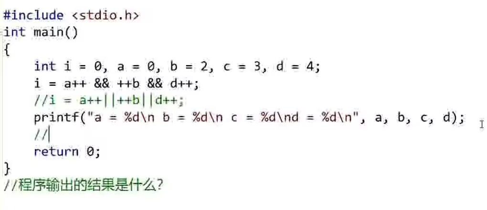

## 算数操作符
`+`</br>
`-`</br>
`*`</br>
`/`</br>
### 除法运算符 /
```c
	int a = 5 / 2;
	printf("%d\n", a);//输出结果2
	double b = 5/2.0;
	double c = 5/2;
	printf("b = %lf c = %lf\n", b, c);//输出结果b = 2.500000 c = 2.000000
```
整数除法和浮点除法不一样。</br>
**一定要注意，做浮点除法的时候，除式 or 被除式要有一个是浮点**</br>
### 取模运算符 %
```c
	//double a = 5 % 2.0;//不合法
```
不合法，提示取模操作符右边不能是浮点类型。
## 移位操作符
`<<`</br>
`>>`</br>
### 原码、反码、补码
整数有3中储存方式，存储到内存的是补码。</br>
对于正数，源码反码补码都一样。</br>
在计算机中，用 32 个比特位存储 int 类型的数据。其中，第一位数字是 0 还是 1，决定了这个数是正数还是负数。</br>
**反码**：原码符号位不变，其他位按位取反。</br>
**补码**：反码 +1。</br>
以 1 和 -1 分别举例。省略中间24个0。
|十进制|    原码    |    反码    |    补码    |
|------|-----------|-----------|-----------|
|   1  |0000...0001|0111...1110|0111...1111|
|  -1  |1000...0001|1111...1110|1111...1111|

### 左移和右移操作符
`>>` 和 `<<` 是右移操作符和左移操作符，移动的是二进制位。
```c
	int a = 16;
	a >> 1;
	printf("%d\n", a);
```
右移操作符有两种移动方式：算数右移和逻辑右移。</br>
算数右移：右边丢弃，左边补原符号位（符号位：负数是 1，正数是 0）</br>
逻辑右移：右边丢弃，左边补 0.</br>
右移要分为算术移位和逻辑移位。</br>
左移没有逻辑移位和算术移位的差别。</br>

规律：左移：乘二；右移：除以二（扔掉小数）。（-1 和 1 特殊讨论）</br>
**注意事项**：</br>
1、移位的数字只能是正数，例如`int b = a >> -1;`就是未定义的行为。</br>
2、只能作用于整数。
## 位操作符
`&` </br>
`|` </br>
`^` 
```c
	//###########位操作符##########
	// & 按位与：有 0 则 0，同 1 才 1
	// | 按位或：有 1 则 1，同 0 才 0
	// ^ 按位异或：同则为 ，不同为 1
	int a = 3;//0x24 00000011
	int b = 9;//0x24 00001001
	// 3 & 9 = 0x24 00000001 = 1
	// 3 | 9 = 0x24 00001011 = 11
	// 3 ^ 9 = 0x24 00001010 = 10
	printf("a = 3, b = 9\n\na & b = %d\n\na | b = %d\n\na ^ b = %d\n", a & b, a | b, a ^ b);
```
### 练习 1：int 交换
不创建临时变量，交换两个int类型的变量值
可以想到的一种可行的方法是，`a = a + b; b = a - b; a = a - b;`但是利用位操作符可以实现更加精妙的操作。
```c
	printf("交换前：a = %d  b = %d\n", a, b);
	//int_swap(a, b);//利用位操作符完成两个整型的交换
	a = a ^ b;
	b = a ^ b;
	a = a ^ b;
	printf("交换后：a = %d  b = %d\n", a, b);
```
这个算法太妙了，既不用临时变量，还避免了溢出。

### 练习 2：数二进制 1 的个数
求一个正数存储在内存中的二进制中的 1 的个数。
```c
//##########求 1 个数##########
int count_1(unsigned int x)
{
	//短除法求 1 的个数
	int count = 0;
	while (x)
	{
		if (x % 2 == 1)
			count++;
		x = x / 2;
	}
	return count;
}
```
很遗憾的是，上述函数在计算负数的时候无法正常工作，需要一些更好的处理方法。
我们考虑按位与的操作。把待检测数字与 1 按位与，如果结果是 1，则说明待测数字末位是 1，count ++，否则是 0；然后将
待测数字向右移动一位，继续比较。重复31次；最后，如果被测数字是负数，那么就 count ++（如果是逻辑右移，那就省略负数检测）</br>
**与 1 按位与，然后右移**</br>
```c
int count_1_opt(int x) 
{
	//移位法求 1 的个数
	int count = 0;
	for (int i = 0; i < 32; i++)
	{
		if (1 == ((x >> i) & 1))//这里需要注意括号的使用，来调整运算优先级
			count++;
	}
	return count;
}
```
貌似还有更精妙的方法。只能说，二进制的世界太奇妙了，在后续的考研学习中我肯定会接触到更多这类型的问题，暂时先离开这片神奇空间，进入下一个部分的学习。
## 赋值操作符
`=`</br>
用得很多的功能。注意与`==`区分，特别容易出错。
### 复合赋值操作符
`+=`</br>
`-=`</br>
`*=`</br>
`/=`</br>
`%=`</br>
`>>=`</br>
`<<=`</br>
`&=`</br>
`|=`</br>
`^=`</br>
其实只是一种简洁的写法，没什么神奇的地方。
## 单目操作符
双目操作符：例如 `+  -  *  /  &  >>`，都是需要左右两个操作数
单目操作符：
`!`</br>
`-`</br>
`&`</br>
`*`</br>
`sizeof()`</br>
`~`</br>
`++`</br>
`--`</br>
`(类型)`
```c
	// sizeof
	//tricky example
	short s = 0;
	int a = 10;
	printf("%d\n",sizeof(s = a + 5));
	printf("%d\n", s);
```
输出结果是 2 0</br>
**两个知识点**：
1、在用 int 对 short 赋值的时候，short 存不下，sizeof 还是按照 int 的大小来计算；
2、sizeof()中的运算符是不参与计算的；
```c
	// ~
	//按位取反
	int a = 0;
	printf("%d\n", ~a); // -1
```
```c
	// ++
	// 左 ++，右 ++
	int a = 0;
	printf("%d\n", ++a); //先 ++，再 print 1
	printf("%d\n", a++); //先 print 1，再 ++
	printf("%d\n", a); // 2
```
```c
	// (int) (float) 强制类型转换
	int a = (int) 3.14;
	printf("%d\n", a); // 3
```
## 关系操作符
` ==`</br>`>=`</br>`<=`</br>`>`</br>`<`</br>`!=`</br>
## 逻辑操作符
`&&`</br>`||`</br>
```c
	printf("%d\n", 3 && 4); // 1
```
### 练习 3：计算下列程序的运行结果
</br>

输出结果居然是`a = 1 b = 2 c = 3 d = 4`</br>
知识点：</br>
1、++a 先计算再自增；</br>
2、&& 如果发现有一边（a）为 0，那就不会继续计算 ++b 和 d++ 了；</br>**短路效应**</br></br>
如果 && 变成 ||</br>
输出结果变为`a = 2 b = 2 c = 3 d = 4`</br>
## 条件操作符(三目运算符)
`exp1 ? exp2 : exp3`</br>
exp1 是真的吗？如果是的话，那就执行 exp2，否则执行 exp3。比 if else 更省事一点。
## 逗号操作符
`exp1, exp2, exp3, ...`</br>

## 下标引用操作符
`[]`</br>
## 函数调用操作符
`Func()`</br>
## 类型访问操作符
`.`</br>
`->`</br>
```c
struct Stu
{
	char name[20];
	int age;
	char id[20];
};//创建一个结构体类型

int main()
{
	struct Stu p1 = { "Jack", 20, "20201101"};//用结构体类型创建一个结构体变量
	printf("%d\n%s\n%s\n", p1.age, p1.name, p1.id);

	//接下来创建一个指向该结构体的指针变量
	struct Stu* ps1 = &p1;
	printf("%s\n", (*ps1).id);//这里发现用 . 操作符有点麻烦，可以用指针 + 结构体专属的 -> 操作符
	printf("%s\n", ps1->name);//不用打星号了！！
	return 0;
}
```
## 隐式类型转换
### 整型提升：
```c
int main()
{
	char a = 3;
	char b = 127;//注意，127 刚好是 8 个比特位（1 个字节）所能存储的最大整数
	char c = a + b;
	printf("%d\n", c);//注意，这里打印的占位符是 %d 而不是 %c
	//打印结果是 -126
	return 0;
}
```
会出现以上结果的原因，是因为 `char` 在内存内进行计算的时候，会先提升为整型类型，然后再进行截断。也就是说，虽然 `char` 只占一个字节，但在计算之时
提升到了四个字节。上述代码中的过程可以用拆成二进制的方法进行分析，分析如下：
```c
	char a = 3;
	// 00000011
	char b = 127;//注意，127 刚好是 8 个比特位（1 个字节）所能存储的最大整数
	// 01111111
	char c = a + b;
	//计算的时候，a 和 b 变成了
	//a = 24x0 00000011
	//b = 24x0 01111111
	//c = a + b = 24x0 10000010
	//算完之后，c 的值变成了
	//c = 10000010
	//但是注意 c 的存放方式，是补码的形式存放，也就是
	//c 的补码： 24x1 10000010
	//c 的反码： 24x1 10000001
	//c 的原码： 1000 16x0 01111110 = -126
	printf("%d\n", c);//注意，这里打印的占位符是 %d 而不是 %c
	//打印结果是 -126
	return 0;
```
有点复杂，等后面熟悉了原码反码补码再来复习一下。</br>
另一个比较直接的例子：
```c
	char c = 1;
	printf("%u\n", sizeof(c)); // 1
	printf("%u\n", sizeof(+c));// 4 + 是算数运算，会进行整型提升
	printf("%u\n", sizeof(!c));// 1 ! 是逻辑运算
```
### 算数转换
小类型依据大类型，扩大自己的比特位。例如</br>
```c
	double b = 3.14; 
	int a = b;
```
在这里，对 a 的比特位进行了扩增。（赋值运算结束后截断）

### 操作符的属性

1、操作符的优先级</br>
如果操作符管到了同一个操作数，那么会根据优先级决定执行顺序。优先级一样，那就考虑 结合性。</br>
2、操作符的结合性</br>
N/A L-R R-L</br>
这玩意有个表格。</br>
规律：</br>
单目：右到左；</br>
双目：左到右</br>
3、是否控制求值顺序</br>
`&&`和`||`和`?:`会控制求值顺序。</br></br>
**如果我们的表达式不能通过操作符的属性确定唯一的计算路径，那么这个表达式就是存在问题的**</br>

