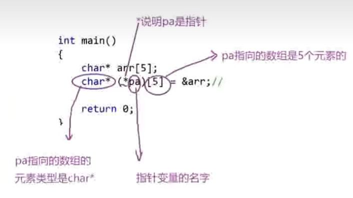

## 字符指针

### 练习 1：两种定义指针的方法是否相等？
```c
    char arr1[] = "abcdef";
    char arr2[] = "abcdef";
    char* p1 = "abcdef";
    char *p2 = "abcdef";
    if (arr1 == arr2)
    {
        printf("equal\n");
    }
    else
        printf("unequal\n");
```
运行结果是 **unequal**，因为`arr1`和`arr2`是首元素的指针，而不是首元素或数组的值。两个数组虽然存储内容是一样的，但是指针是不一样的。
如果把判断条件改为
```c
    if (p1 == p2)
```
运行结果是什么呢？
答案是 **equal**。
因为在定义`p1*`和`p2*`的时候，使用的字符串`"abcdef"`被视为常量字符串，为了节省空间，内存中只存了一份。
需要注意的是，在直接使用常量字符串定义指针的时候，最好加上声明 `"const"`
```c
    const char* p1 = "abcdef";
```

## 指针数组
用来存放指针的数组
```c
    int a = 1;
    int b = 1;
    int c = 4;
    int d = 5;
    int* parr[4] = {&a, &b, &c, &d};//存放整型指针的数组
    char* pch[10];//存放字符指针的数组
```
### 指针数组的应用
```c
    int arr1[] = {1,2,3,4,5};
    int arr2[] = {2,3,4,5,6};
    int arr3[] = {3,4,5,6,7};
    int* parr[] = {arr1, arr2, arr3};//二维数组！
    for(int i = 0; i< 3;i++)
    {
        for(int j = 0;j<5;j++)
        {
            printf("%d ",*parr[i]+j);
        }
    }
```
## 数组指针
数组指针是能够指向数组的指针。
```c
    int* arr = {0};
    //*arr: 首元素地址
    //arr[]：首元素地址
    //&arr：数组的地址
    //但是如果真的要取数组地址，应该怎么做呢？
    int (*p)[10] = &arr;
    //上面的 p 就是数组指针
    //注意括号：打括号避免 p 先结合[5]，强调这个数组的元素类型是int *p
```
### 练习 1：如何定义指针？
```c
    char* arr[5];
    pa = &arr; //修改这行代码，让 pa 能正确表示数组 arr 的数组指针
```
要注意，`char* arr[5];`这段代码的含义是：创建一个元素类型是 `char*` 的 **指针数组**
我们希望做的事情是：创建一个指针`pa`，让这个指针指向**指针数组**
因此，`pa`的类型应该是：指针数组的元素类型，也就是   `char* (*pa);`
如果要取整个数组的指针，、应该这样写：
```c
    char* (*pa)[5] = &arr;
```
下图分析了对`pa`进行定义的时候的三个部分

### 练习 2：这几个声明都是在干嘛？
```c
    int arr[5];
    int* parr1[10];
    int (*parr2)[10];
    int (*parr3[10])[5];
```
```c
    int arr[5];
    //声明了一个数组，数组内有 5 个 int 类型变量
    int* parr1[10];
    //声明了一个指针数组，数组内有 10 个 int* 类型指针
    int (*parr2)[10];
    //声明了一个数组指针，指针指向 parr 这个数组，parr 有 10 个 int 类型的元素
    int (*parr3[10])[5];
    //声明了一个数组，数组有 10个元素，每个元素是一个数组指针，
    //该数组指针指向的数组有 5 个元素，每个元素都是 int
```
先看离变量名最近的东西 是`[]`还是`*`，如果是`[]`，那就是数组，如果是`*`，那就是指针。在`parr3`中，离得最近的是`[10]`，因此它是一个有 10 个元素的数组，剩下的一坨内容是`int (*   )[5]`，这代表数组的元素是数组指针，这些指针各自指向一个数组，数组有 5 个 `int` 类型的元素。
    我超
### 数组指针的应用：二维数组
```


```
