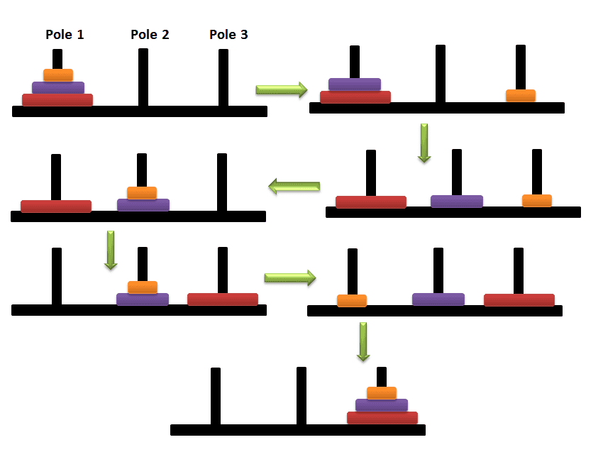

史上最简单的递归：main 函数调用自己
```c
int main()
{
    printf("NB\n");
    return main();
	return 0;
}
```
报错：**栈溢出 (stack overflow)**。递归常见错误。

### 练习 1 打印每一位
接收一个整型值（无符号），按照顺序打印每一位，例如，输入 1234，输出 1 2 3 4
```c
//##########打印每一位##########
void num_Print(unsigned int n)
{
	//思路：%10、/10,逆序输出
	if (n >= 10)
		num_Print(n / 10);
	printf("%d ", n%10);
}
```
### 练习 2 求字符串长度
要求不允许创建临时变量，求字符串长度。
```c
//##########字符串长度##########
int get_str_Len(char* ch)
{
	//char* ch表示输入的字符串的指针，从头到尾扫一遍，如果出现\0就终止
	if (*ch == '\0')
		return 0;
	return 1 + get_str_Len(ch+1);//ch+1，即指针往后移动一格
	//对于指针，我还是不甚了解……
	//数组传参，传过去的不是整个数组，而是首元素的地址
}
```

### 练习 3 递归求阶乘
写一个函数求 n 的阶乘（不考虑溢出）。
```c
//##########求n的阶乘##########
int factorial(int n)
{
	if (n == 0)
		return 1;
	return factorial(n - 1) * n;
}

```

### 练习 4 斐波那契数列
写一个函数求斐波那契数列第 n 项（不考虑溢出）。
```c
//##########求斐波那契数列第n项##########
int fibonacci(int n)
{
	//斐波那契数列：1,1,2,3,5,8,13……
	//当n>=3，a(n) = a(n-1)+a(n-2)
	if (n == 1 || n == 2)
		return 1;
	return fibonacci(n - 1) + fibonacci(n - 2);
	//程序时间复杂度O(2^n)，效率非常低下
}
```
在求斐波那契数列的过程中，发生了重复计算的现象，例如
              a50</br>
        a49         a48</br>
     a47  a48     a46   a47</br>
a45 a46 a46 a47 a44 a45 a45 a46</br>
……</br>
在这个角度，递归不如循环，接下来写一个函数，用循环来求斐波那契数列</br>
在求斐波那契数列这个问题上，虽然使用递归代码精简逻辑简单，但是效率过低
```c
int fibonacchi_opt1(int n)
{
	//求斐波那契数优化版
	//opt的意思是optimized，优化版
	//因为递归是逆推，循环是正推，且可以储存数据，尝试使用循环的方法
	long n1 = 1;
	long n2 = 1;
	long n3 = 1;
	for (int i = 2; i < n; i++)
	{
		n3 = n2 + n1;
		n1 = n2;
		n2 = n3;
	}
	return n3;
}
```
递归其他问题：规模太大的时候，会发生栈溢出。

### 练习 5 汉诺塔问题
三根柱子 A B C，A 柱上有 n 个环，上小下大，依次堆叠。游戏目标是，利用 B 柱，将 A 柱上的所有的环到从 A 柱移动到 C 柱，并保持上小下大的模式。一次仅能移动一个环，移动过程中也必须保持所有柱子上的环都是上小下大。</br>
要求：输入数字 n，即 A 柱上的初始数量，输出一系列操作，最终完成游戏目标。输出格式举例：</br>A -> B</br>B -> C</br>...

</br>

可以考虑递归，每次把最后一个环移动到C柱上即可</br>
**n == 1**</br>
A -> C</br>
记为操作 M<sub>1</sub>(A,C)</br>
**n = 2**</br>
A -> B, A -> C, B -> C</br>
记为操作 M<sub>2</sub>(A,C)。</br>
M<sub>2</sub>(A,C) = M<sub>1</sub>(A,B) + A -> C + M<sub>1</sub>(B,C)</br>
**n == 3**</br>
先用类似 M<sub>2</sub> 的操作，将前两块移动到同一个柱子上，但是不是移动到 C 柱，而是移动到 B 柱，将 C 柱空出来，以接收第三个环。</br>
A -> C, A -> B, C -> B</br>
A -> C</br>
再进行一次 M<sub>2</sub> 的操作，这次是把 B 柱上的两个环移动到 C 柱。</br>
B -> A, B -> C, A -> C</br>
可见，统共进行了两次操作 M<sub>2</sub>，以及一次额外的移动。将这一系列操作记为操作 M<sub>3</sub>。</br>
M<sub>3</sub>(A,C) = M<sub>2</sub>(A,B) + A -> C + M<sub>2</sub>(B,C)</br>
**n == 4**</br>
先进行一次 n = 3 的操作，将前三块全部移动到 B 柱，再将第四块移动到 C 柱，再将 B 柱上的三块移动到 C 柱即可。</br>
显然，统共进行了两次操作 M<sub>3</sub>，以及一次额外的移动。</br>
M<sub>4</sub>(A,C) = M<sub>3</sub>(A,B) + A -> C + M<sub>3</sub>(B,C)</br>
**n == n**</br>
先进行一次 n = n - 1 的操作，将前 n - 1 块移动到 B，再将第 n 块移动到 C，再将 B 柱上的移动到 C 柱即可。</br>
*其实做到这里，对于n阶汉诺塔需要的总的操作次数已经清晰了，那就是 2^n - 1 次，但是我们程序要求的是输出具体的操作，还需要进一步思考。*</br>
*在前面，我创造了一种记录操作的符号，叫做 M<sub>i</sub>(X,Y)，其实这就是一种可以进行递归的函数，我们尝试用 C 语言实现这个函数。*</br>
***M<sub>n</sub>(X,Z,Y) = M<sub>n-1</sub>(X,Y,Z)+ X -> Z + M<sub>n-1</sub>(Y,Z,X)</br>
其中，X 是初始柱，Z 是目标柱，Y 是辅助柱</br>
终止条件 n == 0</br>
元步骤：X -> Y, X -> Z, Y -> Z</br>***
思路捋清楚之后，尝试实现这个函数。</br>
```c
//##########汉诺塔问题##########
int global_tot = 0;//计数变量
int Hanoi_Tower(int n,char X, char Z,char Y)
{
	//n是初始柱上的元素个数，X是初始柱，Z是目标柱，Y是辅助柱，
	//其实就是ABC柱子，但是为了防止混淆,所以切换了一个称谓
	if (n == 0)
		return 0;
	Hanoi_Tower(n - 1, X, Y, Z);
	global_tot++;
	printf("%6d %c -> %c\n",global_tot,X, Z);
	Hanoi_Tower(n - 1, Y, Z, X);
}
```

### 练习 6 青蛙跳台阶
有 n 个台阶，青蛙一次可以跳一个台阶，一次也可以跳两个台阶，这只青蛙如果要跳到第 n 个台阶，有多少种跳法？</br>
```c
//其实只需要考虑最后两级台阶的跳法。
//在跳上第 n 级台阶的时候，总的可能的次数是 n - 1 级台阶加 n - 2 级台阶的可能次数，也即是一个斐波那契数列。
//代码略
```
